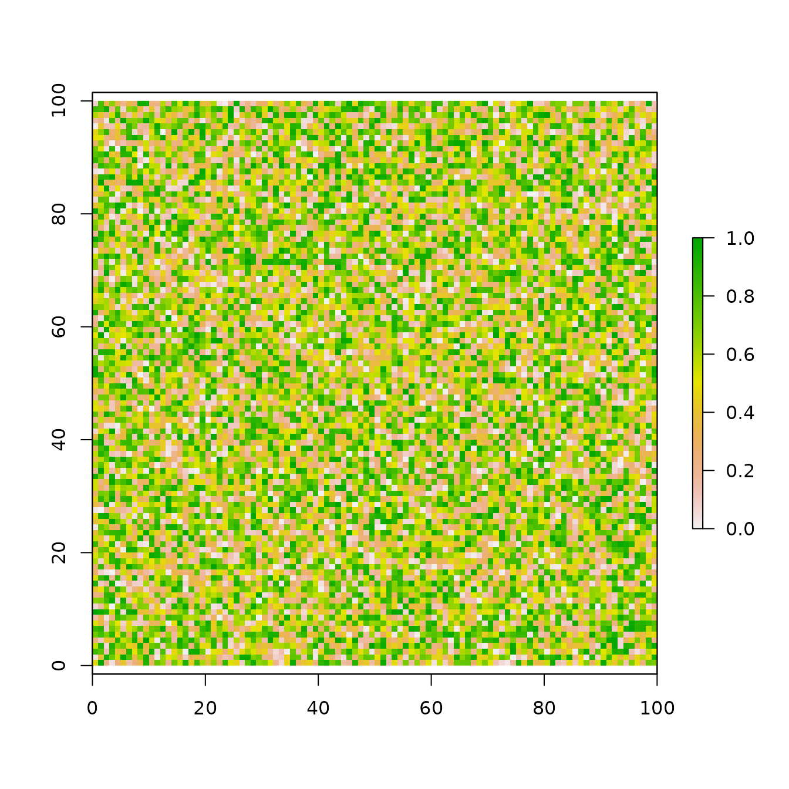
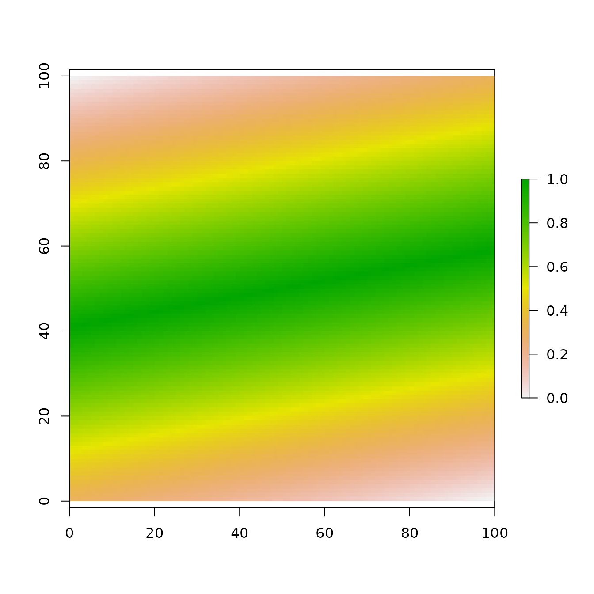
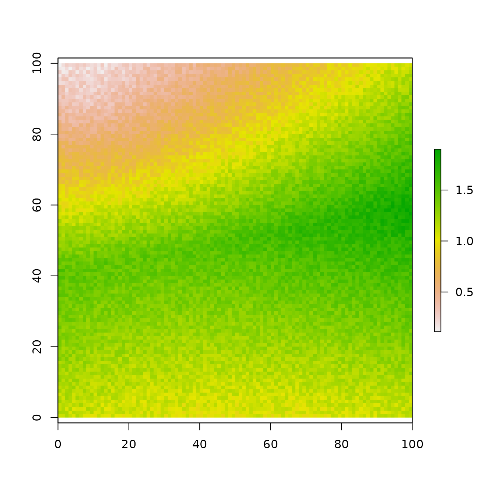
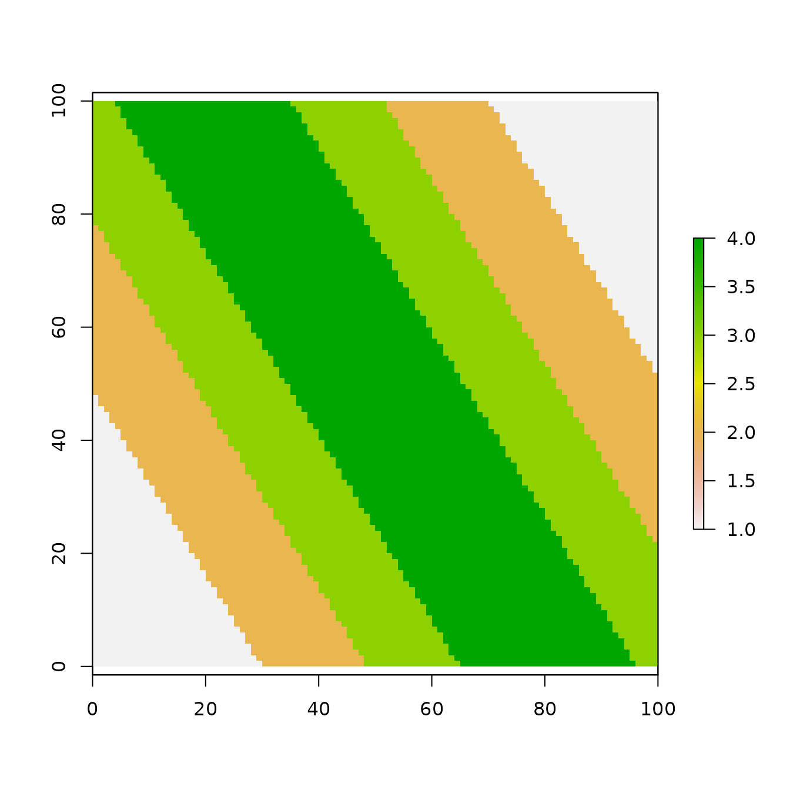

# Basic Usage of NLMR

`NLMR` is a `R` package designed to generate neutral landscape models
(NLMs), simulated landscapes used to explore landscape scale ecological
patterns and processes. The `NLMR` package was designed with a similar
philosophy to the Python package `NLMpy` (see Etherington et al. 2014),
offering a general numeric framework allowing for a high degree of
flexibility. Most of the common NLMs, as described by the relevant
literature, can be produced using NLMR. Additionally, NLMR allows users
to merge multiple landscapes, classify landscape elements categorically
and measure basic landscape level metrics. All NLMs produced take the
form of two-dimensional raster arrays with specified row and column
dimensions and cell values ranging between 0 and 1. By returning raster
arrays, NLMs are easily integrated into the workflow of many useful
spatial analysis packages, notably the `raster` package.

For further information on neutral landscape models, the authors goals
for this package, and additional use case examples please see the
associated publication Sciani, Fritsch, Scherer and Simpkins (2018).

## Basic landscape generation

`NLMR` supplies 16 NLM algorithms. The algorithms differ from each other
in spatial autocorrelation, from no autocorrelation (random NLM) to a
constant gradient (planar gradients) (see Palmer 1992).

The 16 NLM algorithms are:

1.  distance gradient
2.  edge gradient  
3.  hierarchical curdling
4.  wheyed hierarchical curdling
5.  midpoint displacement
6.  neighbourhood clustering
7.  planar gradient  
8.  random  
9.  random cluster nearest-neighbour
10. random element
11. random mosaic fields
12. random polygonal landscapes
13. random percolation  
14. random rectangular cluster
15. spatially correlated random fields (Gaussian random fields)  
16. two-dimensional fractional Brownian motion

The basic syntax used to produce a NLM landscape is:

    nlm_modeltype(ncol, nrow, resolution, ...)

For example, to produce a simple random neutral landscape one could use
the following code:

``` r

x <- NLMR::nlm_random(100, 100)
plot(x)
```



## Merging landscapes

Multiple NLM rasters can be merged to create new landscape patterns. A
single primary or base raster can be merged with any number of
additional secondary rasters, with optional scaling factors used to
control the influence of the secondary rasters.

``` r

# Create primary landscape raster
pL <- NLMR::nlm_edgegradient(ncol = 100,
                             nrow = 100)
plot(pL)
```



``` r

# Create secondary landscape rasters
sL1 <- NLMR::nlm_distancegradient(ncol = 100,
                                  nrow = 100,
                                  origin = c(10, 10, 10, 10))
sL2 <- NLMR::nlm_random(ncol = 100,
                        nrow = 100)

# Merge rasters with scaling factors
mL1 <- pL + (sL1 + sL2 * 0.2)

plot(mL1)
```



## Classifying categories

Landscape rasters generated by `NLMR` contain continuous values between
0 and 1, though these can be converted into categorical values using
`util_classify`.

``` r

nr <- NLMR::nlm_edgegradient(ncol = 100,
                             nrow = 100)

nr_classified <- util_classify(nr, n = 4)

raster::plot(nr_classified)
```



## References

Etherington, Thomas R., E. Penelope Holland, and David O’Sullivan. 2014.
“NLMpy: A Python Software Package for the Creation of Neutral Landscape
Models Within a General Numerical Framework.” *Methods in Ecology and
Evolution* 6 (2): 164–68. <https://doi.org/10.1111/2041-210X.12308>.

Palmer, Michael W. 1992. “The Coexistence of Species in Fractal
Landscapes.” *The American Naturalist* 139 (2): 375–97.
<https://doi.org/10.1086/285332>.

Sciaini, Marco, Matthias Fritsch, Cédric Scherer, and Craig Eric
Simpkins. 2018. “NLMR and Landscapetools: An Integrated Environment for
Simulating and Modifying Neutral Landscape Models in r.” *Methods in
Ecology and Evolution* 0 (0). <https://doi.org/10.1111/2041-210X.13076>.
