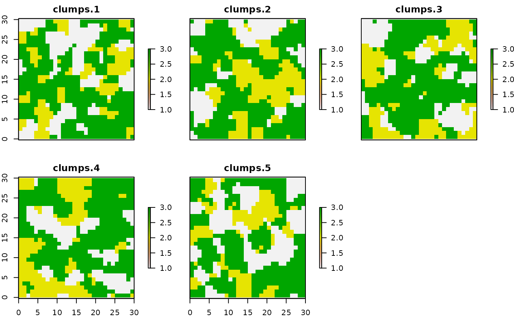
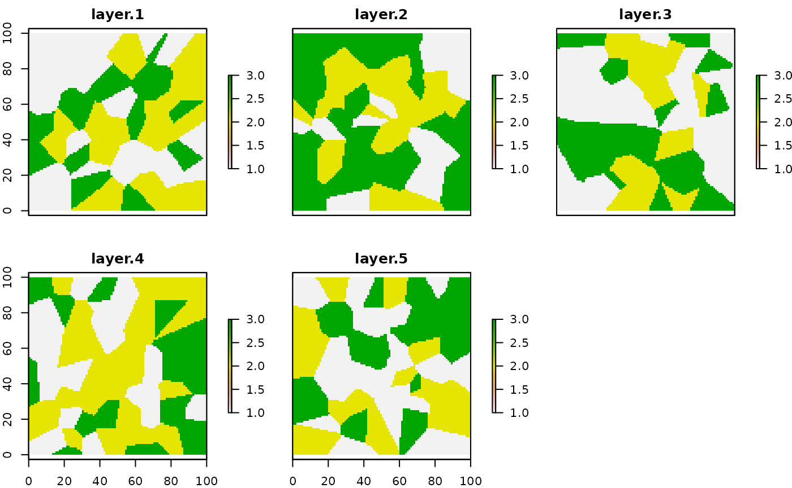

# NLMR Software Heritage

One of the compelling reasons to actually use NLMR is to substitute any
of the other software out there to simulate neutral landscape models.
This vignette therefore aims to be a collection of code snippets that
can be used to imitate the functionality of previous tools (e.g. QRULE).

The list is very much work in progress, if this is of concerning to you
it makes probably sense to revisit here in the future.

## Replicate maps

One of the reasons to actually use neutral landscape models is the
statistical comparison and testing and development of landscape metrics.
Therefore, one needs replicates.

### Built in parameters

The neutral landscape models from **NLMR** can be simulated with a
varying number of parameters to control for spatial autocorrelation.
Simulating replicates that have the same properties as the parameter of
interest can therefore be achieved like this:

``` r

library(NLMR)
library(purrr)
library(raster)
#> Loading required package: sp

# write a simulation function with the desired parameters
simulate_landscape = function(x) {
  nlm_randomcluster(
  ncol = 30,
  nrow = 30,
  p = 0.4,
  ai = c(0.25, 0.25, 0.5),
  rescale = FALSE
  )
}

# rerun it for example 5 times
landscape_list <- rerun(5, simulate_landscape()) 
#> Warning: `rerun()` was deprecated in purrr 1.0.0.
#> ℹ Please use `map()` instead.
#>   # Previously
#>   rerun(5, simulate_landscape())
#> 
#>   # Now
#>   map(1:5, ~ simulate_landscape())
#> This warning is displayed once per session.
#> Call `lifecycle::last_lifecycle_warnings()` to see where this warning was
#> generated.

# look at the result
plot(stack(landscape_list))
```



### Landscape metrics

If you are interested in landscapes that share a metric which is not a
built-in parameter, the most clever way I can came up with is to
simulate models as long as it takes to have the desired number of
landscapes with a certain metric.

An exemplary workflow for this could look like this:

``` r

library(NLMR)
library(landscapemetrics)

# simulation helpers
n <- 1 # counter and index variable
sim_results <- list() # list to store simulation results

# loop until we have 5 landscapes with the metric we are interested in
while (n < 6) {
  # In this use case we are interested in a categorical metric,
  # which is why we reclassify the continous result in three categories
  landscape <- nlm_mosaictess(100, 100, germs = 50) |>
    util_classify(n = 3)
  
  # We are interested in the Euclidean Nearest Neighbor Distance Distribution
  enn_value <- lsm_l_enn_mn(landscape)$value
  
  # ... and we want to keep simulation results that have a mean ENN
  # between 7.5 and 8
  if (enn_value > 7.5 | enn_value < 8) {
    sim_results[[n]] <- landscape
    n = n + 1
  }
}

# look at the results
plot(stack(sim_results))
```


